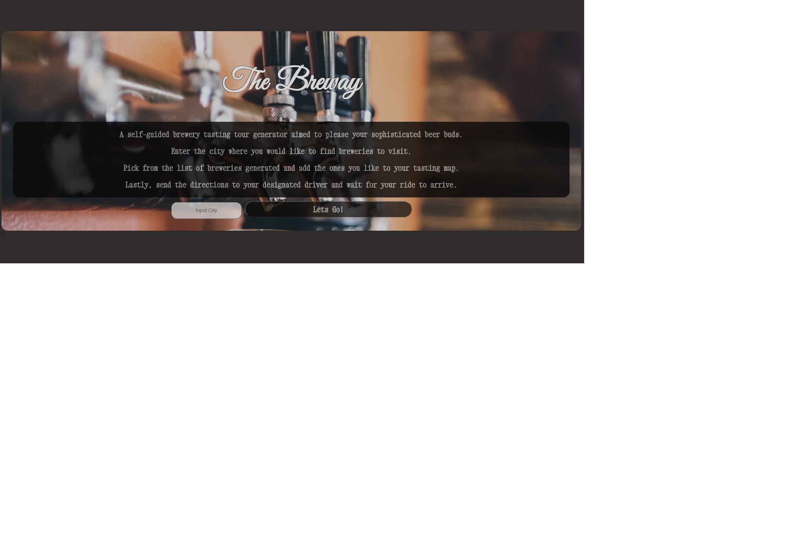

# brewery-tasting-tour-group-project

## Description
For this group project we were tasked with creating a web application from scratch. The main requirements were to use two server side APIs and provide an interactive website experience for the user based off their input. Our group created a web application that searched for local micro breweries in the city the user typed in the search box. The goal of the web application was to generate a brewery tasting tour map based on the user's choices from the list of breweries provided. Our brewery tasting tour map application performs the following tasks.
    <ul>
        <li>Asks for the city input from the user.</li>
        <li>Generate an array of breweries using the Open Brewery DB API. We use the following search criteria: we only look for micro breweries in the city entered, and limit the search return to 25 breweries.</li>
        <li>The brewery names are displayed on the screen as buttons.</li>
        <li>When the user clicks on a brewery name, the information for that brewery is rendered on the screen for the user to view to help them make a decision on whether to the brewery to their brewery tasting tour list. The information displayed on the screen: brewery name, address, phone number, and website.</li>
        <li>On the rendered brewery display there is an "add to tour" button. The user is able to add up to 5 breweries to their tour list.</li>
        <li>Once the user is finished adding breweries to their tour list, they click on the "generate map" button to generate their brewery tasting tour map.</li>
        <li>Google Maps Direction API is used to generate a map with multiple stops. The Google Maps API directionsDisplay and directionsRenderer functions are used to render and display tour map to the maps div in the index file. Google Maps Directions API optimizes the route to reduce drive time.</li>
        <li>Once the map is displayed, the user can click on custom map markers for the individual breweries on their tasting route and get the information for each brewery.</li>
        <li>At the bottom of the map the user has the option to start a new search. The start search button takes the user back to the start of the web application.</li>
    </ul>
    
The tasks for the web application were accomplished by: 
    <ul>
        <li>Using the Open Brewery DB API to get brewery data for specific cities</li>
        <li>Using the Google Maps Directions API to get map data for the brewery tour based off of the users input.</li>
        <li>Using jQuery to manipulate the DOM of the index.html.</li>
        <li>Using jQuery on click events for the city input button, the individual brewery buttons, the "add to tour" button, and the "generate map" button</li>
        <li>Using functions to:</li>
        <li>Make API calls to Open Brewery DB API</li>
        <li>Make API calls to Google Maps Directions API</li>
        <li>Render list of breweries retrieved from API to the screen.</li>
        <li>Render individual brewery details on screen based on brewery button the user clicks on.</li>
        <li>Generate brewery tasting tour list based off of user input.</li>
        <li>Generate map and directions panel.</li>
    </ul>

## Technologies Used
<ul>
    <li>APIs/AJAX Calls</li>
    <li>HTML</li>
    <li>CSS</li>
    <li>jQuery</li>
    <li>DOM Manipulation</li>
    <li>Functions</li>
</ul>

## What We Learned

While working on this project, we learned how to work together as a team to create a working web application. We used Github to create and manage tasks as well as our overall project. We learned how to use multiple APIs to create an interactive experience for our users. This project required a lot of psuedo-coding and time outside of class to complete. 

## Link to brewery tasting tour:
https://cdrobinsoniii.github.io/brewery-tour/